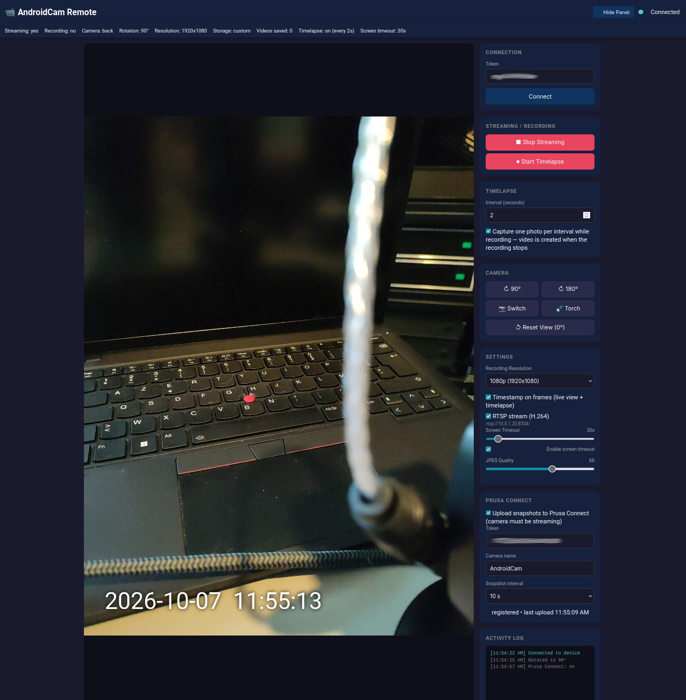

# 📹 AndroidCam

An Android app that streams the camera over the local network as MJPEG, records
H.264 MP4 video, and offers remote control via a token-protected web UI.




## Features

- **Live MJPEG stream** (~10 fps, 720p) served over HTTP
- **MP4 video recording** (H.264, hardware-encoded via CameraX `VideoCapture`)
- **Prusa Connect camera** — register the phone as a camera on a Prusa
  printer and upload snapshots every 10/30/60 s (token by hand or by
  scanning the QR code)
- **Remote control** via web UI (any browser on the same network)
- **Token auth** — every endpoint requires a per-run token (shown in the app
  notification, logcat, and the mDNS advertisement)
- **Device discovery** via mDNS/Bonjour (`_androidcam._tcp`)
- **Foreground service** — streaming and recording survive app backgrounding
- **Screen timeout** — while recording, the screen turns off after a
  configurable idle time (a CPU wake lock keeps recording going)
- **Local controls** — record button, tap-to-focus, and a settings dialog
  (token, timelapse, resolution, JPEG quality, storage location, Prusa
  Connect)

## Quick Start

### Build

```bash
./build.sh            # or: ./gradlew :app:assembleDebug
```

### Run

1. Install the APK on an Android device (API 26+) with a camera
2. Open the app and grant the camera, microphone, and notification permissions
3. The app starts the streaming service and shows a notification with the
   device IP and auth token
4. From any device on the same network, open
   `http://<device-ip>:8080/?token=<token>` in a browser

### Get the token

The token is shown in:

- the app notification (sub-text)
- logcat: `adb logcat | grep "token:"`
- the mDNS advertisement (browse for `_androidcam._tcp` services)

## Architecture

```
┌─────────────────────────────────────────────────────────────────┐
│                        RecordingService                         │
│  (foreground service — owns the whole pipeline)                 │
│                                                                 │
│  ┌──────────────┐    ┌───────────────┐    ┌──────────────────┐  │
│  │CameraManager │───▶│ FrameCapturer │───▶│   StreamServer   │  │
│  │ (CameraX)    │    │ (YUV→JPEG,    │    │ (Ktor/Netty:     │  │
│  │              │    │  ~10 fps)     │    │  MJPEG + REST +  │  │
│  │  • Preview   │    └───────────────┘    │  WebSocket + UI) │  │
│  │  • Image     │                         └──────────────────┘  │
│  │    Analysis  │    ┌───────────────┐    ┌──────────────────┐  │
│  │  • Video     │───▶│ MP4 file      │    │  MdnsDiscovery   │  │
│  │    Capture   │    │ (H.264)       │    │  (mDNS/Bonjour)  │  │
│  └──────────────┘    └───────────────┘    └──────────────────┘  │
└─────────────────────────────────────────────────────────────────┘
         ▲
         │ bind (attach local preview)
┌──────────────┐        ┌──────────────┐
│ MainActivity │───────▶│ DeviceState  │  (shared, thread-safe state)
│ (UI + local  │        └──────────────┘
│  controls)   │
└──────────────┘
```

- **`RecordingService`** owns the camera, stream server, and mDNS advertising.
  It is a foreground service, so streaming/recording keep running after the
  activity is destroyed or the process is restarted.
- **`CameraManager`** is the single owner of the CameraX binding (preview +
  image analysis + video capture). The preview view is optional — the pipeline
  works without it.
- **`FrameCapturer`** converts `ImageAnalysis` frames (YUV_420_888, strides
  honoured) to JPEG at ~10 fps, applying the configured rotation.
- **`StreamServer`** serves the web UI (from `assets/web/`), the MJPEG stream
  (paced to the frame rate), and the control channel. It never mutates the
  pipeline directly — it calls `ControlCallback` methods implemented by the
  service.
- **`DeviceState`** is shared, thread-safe observation state. Writes go
  through setter methods so listeners are notified; the activity observes
  recording state, the server reads it for status.

## Project Structure

```
app/src/main/java/com/androidcam/
├── AppApplication.kt          # Application class, shared singletons, wake lock
├── camera/
│   ├── CameraManager.kt       # CameraX lifecycle (preview, analysis, recording)
│   └── FrameCapturer.kt       # YUV_420_888 → JPEG conversion for streaming
├── control/
│   └── DeviceState.kt         # Central device state (thread-safe)
├── discovery/
│   └── MdnsDiscovery.kt       # mDNS/Bonjour service discovery
├── prusa/
│   ├── PrusaConnectClient.kt  # HTTP client for /c/info + /c/snapshot
│   ├── PrusaConnectSettings.kt# Token/fingerprint/interval settings
│   ├── PrusaUploader.kt       # Snapshot upload loop (crash-proof)
│   └── QrTokenParser.kt       # Extracts the 20-char token from QR payloads
├── stream/
│   ├── RecordingService.kt    # Foreground service owning the pipeline
│   └── StreamServer.kt        # Ktor HTTP/WebSocket server
└── ui/
    └── MainActivity.kt        # Camera preview + local controls
app/src/main/assets/web/
└── index.html                 # Web UI (served at /)
```

## API Reference

All endpoints except `GET /health` require `?token=<token>`.

### REST

| Endpoint | Method | Description |
|----------|--------|-------------|
| `/api/status` | GET | Current device state (JSON) |
| `/api/resolutions` | GET | Supported resolutions ("WxH" strings, highest first) |
| `/api/control/start-streaming` | POST | Start streaming (camera on) |
| `/api/control/stop-streaming` | POST | Stop streaming (camera off) |
| `/api/control/start-recording` | POST | Start recording (MP4) |
| `/api/control/stop-recording` | POST | Stop recording |
| `/api/control/camera/{facing}` | POST | Set camera (`front` / `back`) |
| `/api/control/rotate/{angle}` | POST | Rotate stream (90/180/270) |
| `/api/control/toggle-torch` | POST | Toggle torch |
| `/api/control/resolution/{res}` | POST | Set recording resolution (`1920x1080`, `1280x720`, `640x480`) |
| `/api/control/screen-timeout?enabled={bool}&seconds={n}` | POST | Set screen timeout |
| `/api/control/storage-location?location={loc}` | POST | Set storage (`internal` / `external` / `custom`) — app-only in the UI |
| `/api/control/interval?enabled={bool}&seconds={n}` | POST | Set timelapse interval |
| `/api/control/timestamp?enabled={bool}` | POST | Burn a date/time stamp into timelapse frames |
| `/api/control/jpeg-quality?quality={10-100}` | POST | Set stream JPEG quality |
| `/api/control/prusa-connect?enabled={bool}` | POST | Enable/disable Prusa Connect uploads |
| `/api/control/prusa-token?value={20ch}` | POST | Set the Prusa Connect camera token |
| `/api/control/prusa-name?name={name}` | POST | Set the camera name shown in Connect |
| `/api/control/prusa-interval?seconds={n}` | POST | Set the snapshot upload interval (5-3600 s) |

### WebSocket

Connect to `ws://<ip>:8080/ws/control?token=<token>`. Send JSON commands,
receive JSON responses:

```json
{"action": "start_streaming"}
{"action": "stop_streaming"}
{"action": "start_recording"}
{"action": "stop_recording"}
{"action": "switch_camera"}
{"action": "set_camera", "facing": "front"}
{"action": "rotate", "angle": 90}
{"action": "toggle_torch"}
{"action": "set_resolution", "resolution": "1280x720"}
{"action": "set_screen_timeout", "enabled": true, "seconds": 30}
{"action": "set_storage_location", "location": "external"}
{"action": "set_interval", "enabled": true, "seconds": 60}
{"action": "set_timestamp", "enabled": true}
{"action": "set_jpeg_quality", "quality": 80}
{"action": "set_prusa_connect", "enabled": true}
{"action": "set_prusa_token", "token": "<20-char token>"}
{"action": "set_prusa_name", "name": "Bench cam"}
{"action": "set_prusa_interval", "seconds": 30}
{"action": "start_prusa_qr_scan"}
{"action": "get_status"}
```

`start_prusa_qr_scan` runs a 30 s scan of the stream frames for a QR code
containing a Prusa Connect token (ML Kit barcode scanning); a found token is
set and Prusa Connect is enabled automatically. If the scan had to turn the
camera on, the capture is stopped again when the scan ends.
`inject_test_frame` (debug builds only) overrides the frame the pipeline
sees, for testing without a camera.

### MJPEG

`http://<ip>:8080/stream/mjpeg?token=<token>` — multipart JPEG stream at the
frame rate produced by `FrameCapturer` (~10 fps).

## Permissions

| Permission | Why |
|------------|-----|
| `CAMERA` | Observe the camera |
| `RECORD_AUDIO` | Record audio with the video (falls back to silent video if denied) |
| `INTERNET`, `ACCESS_NETWORK_STATE`, `ACCESS_WIFI_STATE`, `CHANGE_WIFI_STATE` | Stream server + mDNS |
| `FOREGROUND_SERVICE`, `FOREGROUND_SERVICE_CAMERA` | Continuous streaming/recording |
| `POST_NOTIFICATIONS` | Foreground service notification (Android 13+) |
| `WAKE_LOCK` | Keep recording while the screen is off |

No storage permission is needed — recordings are written to the app's private
files directory (`filesDir/videos/`).

## Screen Timeout

While recording, the screen stays on for `screenTimeoutSeconds` (default 30,
configurable from the web UI or WebSocket) after the last touch, then turns
off. A CPU wake lock keeps the camera and encoder running. Touching the
preview resets the timer.

## Prusa Connect

The app can act as a live camera on [Prusa Connect](https://connect.prusa3d.com)
for any printer. Connect cameras are snapshot devices: the app registers itself
with `PUT /c/info` and uploads the latest stream frame with `PUT /c/snapshot`
every N seconds (default 30) — the same protocol Prusa's own ESP32 camera
firmware uses. The MJPEG web UI stays available for real-time viewing.

Setup:

1. In Prusa Connect (web or app): open your printer → Cameras → **Add camera**.
   Connect generates a **20-character token** (a QR code is also shown).
2. In AndroidCam: Settings → **Prusa Connect camera** → enable the switch,
   enter the token, optionally set the camera name and snapshot interval
   (10/30/60/120 s), then Save. The same controls exist in the web UI.
3. Keep the camera **streaming** — while the camera is off there are no
   frames to upload and Connect shows the camera as offline. A wake lock
   keeps uploads running with the screen off.

### Scanning the QR code

Instead of typing the token, point the camera at the QR code shown by Prusa
Connect and press **Scan QR code** in the settings dialog (or send
`start_prusa_qr_scan` over WebSocket). The app scans the live stream frames
with ML Kit barcode scanning for up to 30 s — no second camera session is
needed, the same frames that feed the MJPEG stream are analyzed. The parser
accepts a bare 20-character token or a URL/JSON payload containing it
(`?token=...`, a `/token/...` path segment, or a `"token"` field), so it
works regardless of the exact QR payload format Connect uses.

When a token is found, it is applied immediately and **Prusa Connect is
enabled** — no need to press Save. If the scan had to turn the camera on,
the capture is stopped again when the scan ends (an already-running stream
is left untouched).

Notes:

- The token is bound to the **first device fingerprint** that successfully
  registers it. If a different device (fingerprint) tries to use the same
  token, Connect rejects it with 403 ("Invalid camera 'token' or
  'fingerprint'"). Deleting the camera in Connect invalidates the token;
  re-adding it generates a new one.
- The `Fingerprint` header is a stable 32-char per-device ID generated on
  first run and persisted in `SharedPreferences`.
- The backend hostname defaults to `connect.prusa3d.com` (self-hosted
  instances can be used by changing `PrusaConnectSettings.DEFAULT_HOSTNAME`).

Diagnostics:

- `adb logcat | grep -i prusa` shows every `/c/info` and `/c/snapshot`
  request with fingerprint, byte counts, HTTP status and response body, plus
  upload success/failure lines from the uploader loop.
- A live JVM round-trip test runs the real uploader loop against
  `connect.prusa3d.com` (opt-in, skipped in the default test run):

  ```bash
  PRUSA_LIVE_TEST=1 ./gradlew :app:testDebugUnitTest \
      --tests "com.androidcam.prusa.PrusaUploaderLiveTest"
  ```

  It needs a valid token (override with `PRUSA_TEST_TOKEN`, and
  `PRUSA_TEST_FINGERPRINT` if the token is bound to a custom fingerprint)
  and **binds that token to the test's fingerprint** — use a throwaway
  camera entry, not the one your phone is using.

## Security Notes

- All endpoints are protected by a per-run token (12 random chars).
- Traffic is cleartext HTTP/WS — intended for trusted local networks only.
  Do not expose the port to the internet.
- The token is included in the mDNS advertisement so discovered devices can
  be connected to directly.

## License

Apache 2.0 — see [LICENSE](LICENSE).
